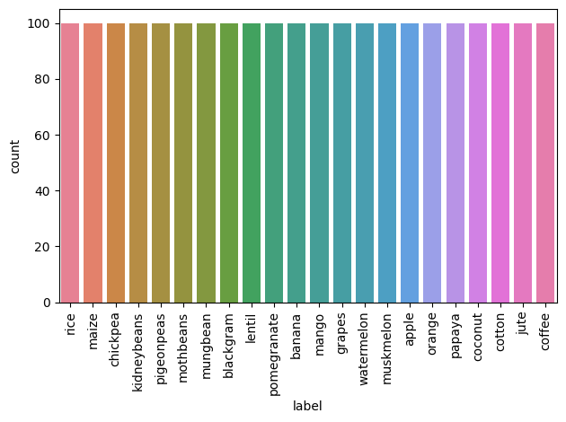
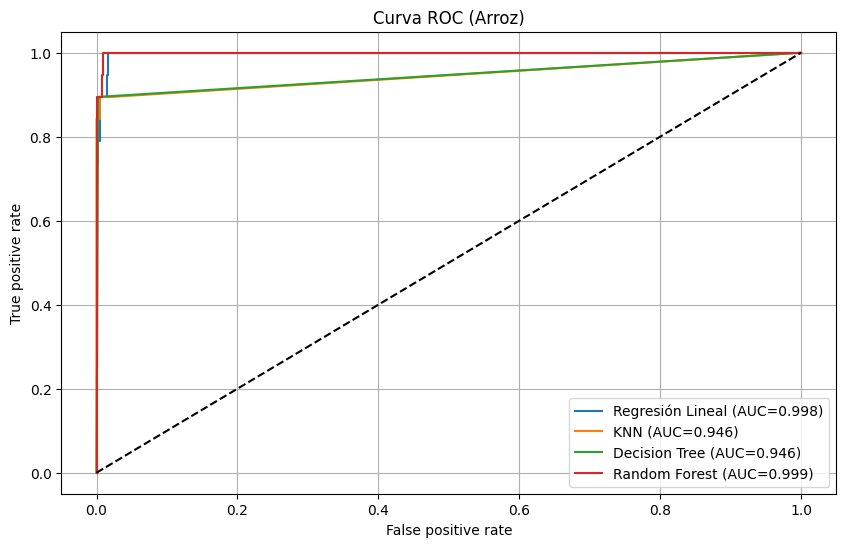

# Predicción de rendimiento de cultivo

## Índice de contenidos
- [1. Descripción del problema](#1-descripción-del-problema)

- [2. Dataset](#2-dataset)

- [3. Modelos Seleccionados](#3-modelos-seleccionados)

    - [3.1. Regresión Logística](#regresión-logística)

    - [3.2. K-Nearest Neighbors](#k-nearest-neighbors)

    - [3.3. Decision Tree](#decision-tree)

    - [3.4. Random Forest](#random-forest)

- [Resultados y Conclusiones](#conclusiones)

    - [Metodología de Trabajo](#metodología-de-trabajo)
    - [Resultados](#resultados)
    - [Conclusiones](#conclusiones)


## 1. Descripción del problema

En los últimos años, la implementación de tecnología en el sector agrícola ha ido en aumento debido a sus beneficios tanto en el cuidado como en la estimación de producción de los cultivos.

Bajo este contexto, conocer las condiciones ideales para plantar y producir ciertos cultivos se ha vuelto crítico para la toma de decisiones de los agricultores, dado que en un mercado tan competitivo, ser consciente de qué tanto provecho se le puede sacar al suelo en base a sus características es clave para pode obtener la mayor cantidad de ganancias al elegir conscientemente el tipo de cultivos que sea mejor cosechar.

Al mismo tiempo, ofrecería la posibilidad tanto evitar elegir cultivos que podrían no entregar resultados positivos según las condiciones de cada caso, así como poder sugerir a los agricultores plantar cosechas que originalmente no tenían en mente pero que resultarían beneficiadas dadas las características de sus suelos, sacándoles así aún mas provecho.

## 2. Dataset
En el presente proyecto, se pretende demostrar a través de un modelo predictivo el fruto mas apto para cultivar en un terreno particular en base a distintos factores que incluyen la composición química de la tierra y datos históricos del clima.
El dataset seleccionado (["Crop Recommendation Dataset"](https://www.kaggle.com/datasets/atharvaingle/crop-recommendation-dataset/data)) recopila datos de distintos datasets provenientes de India y cuenta con los siguientes campos:

- **N** - Proporción del contenido de nitrógeno en el suelo

- **P** - Proporción del contenido de fósforo en el suelo

- **K** - Proporción del contenido de potasio en el suelo

- **temperature** - Temperatura en grados Celsius

- **humidity** - Humedad relativa en %

- **ph** - Valor de PH del suelo

- **rainfall** - Precipitaciones en mm

- **label** - Tipo de cultivo

Sus dimensiones son 2.200 de entradas y 8 columnas, con las cuales se busca predecir el cultivo mas apto entre 22 opciones, entre las cuales se encuentran disponibles:
- **rice**: Arroz
- **maize**: Maíz
- **chickpea**: Garbanzos
- **kidneybeans**: Frijoles
- **pigeonpeas**: Guandules
- **mothbeans**: Frijoles moth
- **mungbean**: Frijoles mungo
- **blackgram**: Lentejas negras
- **lentil**: Lentejas
- **pomegranate**: Granada
- **banana**: Plátano
- **mango**: Mango
- **grapes**: Uvas
- **watermelon**: Sandía
- **muskmelon**: Melón
- **apple**: Manzana
- **orange**: Naranja
- **papaya**: Papaya
- **coconut**: Coco
- **cotton**: Algodón
- **jute**: Yute
- **coffee**: Café

## 3. Modelos Seleccionados

Para abordar este problema de clasificación multiclase, se propone la evaluación comparativa de tres algoritmos. Para asegurar una búsqueda de hiperparámetros robusta y evitar el sobreajuste espacial, la optimización de los modelos se realizará mediante validación cruzada utilizando GridSearchCV. En esta etapa experimental, se propone evaluar el rendimiento guiándose por tres métricas principales: **accuracy** para observar la exactitud global del modelo, **f1_macro** para asegurar un rendimiento equitativo que no discrimine a los cultivos con características más complejas y el área bajo la curva ROC en un enfoque one-over-rest que resulta ideal para clasificaciones múltiples **roc_auc_ovr**.

### Regresión logística
Dadas las condiciones del dataset, y que se plantea un modelo de predicción clasificador, se optó por utilizar un modelo de regresión logística. Para su implementación se diseñará un Pipeline que incluye un escalador para normalizar los datos y se entrenará usando regularización ElasticNet en el proceso.

#### - Motivo
Como se mencionó, dado que se busca la creación de un modelo clasificador, la primera opción a considerar sería la de una regresión logística para empezar a probar por un modelo simple, dada la hipótesis de que varios de los atributos que considera el set de datos poseen una correlación considerable entre sí, tanto positiva como negativa. Se propone el uso de penalización con ElasticNet dado que toma ambos criterios Lasso y Ridge, que para el dataset trabajado podría ser de utilidad y de alta eficiencia.

#### - Ventajas
- Costo de cómputo bajo.
- Interpretabilidad fácil del modelo.
- Ideal para la clasificación en base a probabilidades, dados pocos atributos con los que trabajar.

#### - Limitaciones
- Asume fronteras lineales, por lo que no puede capturar relaciones complejas.
- Es sensible a outliers / valores atípicos, lo que afectaría a la generalización del modelo.

### K-Nearest Neighbors
El segundo modelo considerado para este estudio se basa en el algoritmo de K-Nearest Neighbors. Al basarse enteramente en el cálculo matemático de distancias entre las muestras, este modelo también requerirá estar encapsulado en un pipeline con un escalador para asegurar que todas las métricas (desde el pH hasta los milímetros de lluvia) operen bajo la misma escala.
Se considerarán múltiples números de vecinos (K) y distintas métricas de distancia para encontrar el modelo más eficiente para el dataset.

#### - Motivo
El uso de KNN se justifica por la lógica del dominio agrícola y justamente el objetivo de este estudio: **terrenos que comparten características químicas y climáticas similares tienden a ser aptos para el mismo tipo de cultivo**. KNN agrupa y clasifica basándose exactamente en la "similitud de vecindad", lo que permitirá contrastar los resultados de los otros modelos y capturar agrupaciones de condiciones ideales que no sigan un patrón puramente paramétrico.

#### - Ventajas
- Es muy eficiente para modelar fronteras no lineales / complejas.
- Interpretabilidad fácil del modelo.
- Al ser un modelo no paramétrico, no hace suposiciones previas sobre la distribución de los datos.

#### - Limitaciones
- Presenta un costo computacional elevado al predecir, debido a la necesidad de calcular distancias para clasificar.
- La complejidad del entrenamiento depende altamente de los números de vecinos ($k_i$) y las métricas de distancias (Euclidiana, Manhattan y Minkowski).

### Decision Tree
El tercer modelo considerado corresponde al algoritmo de Árboles de Decisión o Decision Trees. El mismo trabajará con una profundidad máxima de 50, además de repasar si se obtienen diferentes resultados utilizando distintos criterios, pasando por gini, log_loss y entropía.

#### - Motivo
La opción surge por el interés en observar si la aprobación o rechazo en base a ciertos valores de manera más "entendible" y visual podría resultar en un mejor o peor desempeño, más aún considerando que, al trabajar con atributos numéricos como lo son las propiedades químicas para el modelo de predicción, podría dar paso a mejores resultados.

#### - Ventajas
- Ofrece mayor visualización de las decisiones que llevan a los resultados.
- No requiere un proceso de estandarización.

#### - Limitaciones
- No se le puede sacar provecho máximo dado que el dataset no posee columnas categóricas.
- Posibilidad de caer en overfitting en caso de recurrir a una profundidad demasiado alta.

### Random Forest
El último modelo que contempla este proyecto es el del Random Forest, trabajando con el estándar de 100 estimadores, ofreciendo la posibilidad de trabajar con un factor de combinaciones mayor al de los árboles de decisión.

#### - Motivo
El uso de Random Forest viene para comprobar qué tan alto puede ser el puntaje al masificar los árboles de decisión, puesto que al ya haberlos puesto a prueba en el modelo anterior, la evolución natural sería observar el posible aumento de funcionamiento con este algoritmo, además de estudiar de qué forma le otorga los pesos a cada atributo.

#### - Ventajas
- Mayor accuracy al maximizar los árboles de decisión.
- Mejor manejo de los datos faltantes al iterar con varias combinaciones.

#### - Limitaciones
- Mayor complejidad computacional, al utilizar muchas combinaciones.
- Menor interpretabilidad que con los árboles de decisión.

### Estructura del proyecto
```
proyecto-1-inteligencia-artificial/
├── data/                               # Carpeta de datasets a utilizar
│   └── crop_recommendation.csv         # Dataset usado para el proeycto 
├── environment.yml                     # Archivo de dependencias del entorno de Conda
├── proyecto_crop_recomendation.ipynb   # Archivo raíz del proyecto
└── README.md                           # Documentación
```

# Resultados y Conclusiones

Partiendo de la consideración de que el dataset con el que se trabajó corresponde al registro de propiedades químicas, se logra observar en general un alto nivel de precisión respecto a distintas métricas de desempeño, casi logrando clasificaciones perfectas. Esto encuentra su sentido en que las cosechas dependen de gran manera de las condiciones donde crecen, y en caso de que las mismas no sean ideales puede resultar hasta en la muerte de estas durante su crecimiento, esto pudiendo ser estudiado ya sea en la concentración de elementos en el suelo, como las condiciones ambientales como lo pueden ser la lluvia o la humedad del ambiente. Partiendo de esta base, se trabajaron con los 4 modelos mencionados en la presentación, obteniendo distintos desempeños.

## Metodología de trabajo

Previo a la puesta en marcha de los algoritmos, se realizó un análisis exploratorio de los datos, observando que el dataset posee un gran nivel de cuidado, sin presentar valores faltantes ni outliers, esto tras observar tanto un countplot como estudiar las entradas de cada columna y fila, por lo que no hicieron falta acciones de limpieza adicionales de los datos. Al mismo tiempo, dado que el dataset original cuenta con 8 columnas con una diferenciación notoria, no se encontró necesario el uso de un PCA para reducir las mismas, puesto que no presentaron un obstáculo a nivel de cómputo ni dimensiones demasiado altas como para presentar un posible problema de dimensionalidad.



Como se mencionó previamente, dado que se está trabajando con propiedades químicas lineales, se optó estudiar varios modelos más que quedarse con un resultado alto, al mismo tiempo intentando observar qué caracertísticas o ideas se podrían destacar en base a los resultados.

Tanto para la Regresión Logística como para el K-Nearest Neighbors, se trabajó con un pipeline de escalado previo para estandarizar su mediana y desviación estándar, luego aplicando el algoritmo GridSearch para obtener los mejores parámetros. En el caso del primero, se observó que la mejor penalización fué elasticnet, y 2000 iteraciones totales, mientras que en el segundo se trabajó con la distancia de Manhattan y 3 vecinos.

En el caso de los Árboles de Decisión y Random Forest, se puso a prueba primero su funcionamiento bruto como con los mejores parámetros usando el algoritmo previamente mencionado, comprobando su correcto desempeño además con una cross-validation dado a sus alto grado de efectividad en la clasificación, estudiando tanto la media como la desviación estándar obtenidas de la validación cruzada.

Entre los 4 clasificadores, el que entregó mejores resultados fué el Random Forest, donde explorando las combinaciones de valores a adoptar por sus atributos con el algoritmo GridSearchCV, finalmente se trabajó con la Impureza de Gini, y una profundidad de 15 niveles para obtener estos resultados, probándolo posteriormente con una validación cruzada para estudiar un posible overfitting.

## Resultados

### Resumen

| **Modelo** | **Accuracy** | **Área bajo curva ROC** | **Atributos Adicionales** | **Precision** | **Recall** | **F1-score** |
| --- | --- | --- | --- | --- | --- | --- |
| Regresión Logística | 0.975 | 0.99775 | Penalización: ElasticNet <br> Iteraciones: 2000 | 0.98 | 0.97 | 0.97 |
| KNN | 0.975 | 0.94599 | N_neighbors: 3 <br> Distancia: Manhattan | 0.98 | 0.97 | 0.98 |
| Decision Tree | 0.9864 | 0.94618 | Profundidad: 13 <br> Criterio: Gini | 0.99 | 0.99 | 0.99 |
| `Random Forest` | `0.9932` | `0.99912` | `Profundidad: 15` <br> `Criterio: Impureza de Gini` | `0.99` | `0.99` | `0.99` |

- Pesos de atributos: En el caso del Decision Tree y Random Forest, es posible estudiar de manera intuitiva los pesos que cada modelo le dió a los atributos del dataset, donde los resultados muestran que en ambos casos el mayor peso se encuentra concentrado en 'rainfall' seguido de 'humidity', con la diferencia de que el primer modelo le otorga un peso de 0.351099 a la humedad, mientras que el segundo trabaja con 0.227900, postulando la idea de que puede que una dependencia mayor de la lluvia puede llevar falsamente a obtener peores resultados, mientras que balancear de mejor manera el peso haya sido la clave para clasificar de mejor manera.

- Área bajo la curva: Como se puede observar en la figura, 



## Conclusiones

### Autores a cargo (Nombre de Usuario de GitHub)
- Alejandro Reyes (fleajrv)
- Felipe Sánchez (Felipe-SSC)